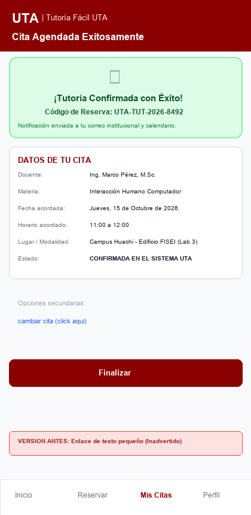
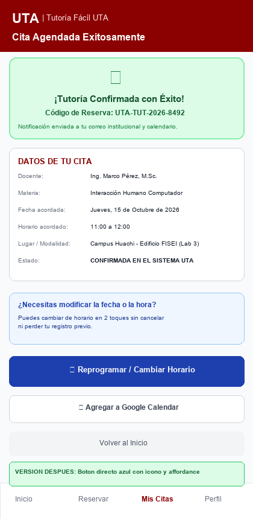

# Protocolo de Prueba Cruzada y Documentación de la Iteración

## 1. Ficha de la Prueba Cruzada

* **Sistema evaluado:** Tutoría Fácil UTA (Prototipo v1.0 -> v1.1)
* **Fecha de ejecución:** 30 de Septiembre de 2026
* **Evaluador responsable:** Carlos Giovanni Ramos Jácome (Tester / QA - Grupo 5)
* **Participante evaluado:** Kevin Morales (Estudiante de 5to Semestre de Ingeniería de Software, Grupo 2 de IHC - Usuario externo sin conocimiento previo de la interfaz).
* **Tarea solicitada:** *«Reserve una tutoría académica para el día jueves y posteriormente cambie el horario acordado»*.
* **Regla metodológica:** El evaluador no proporcionó explicaciones verbales sobre el funcionamiento de la interfaz durante la ejecución.

---

## 2. Registro de Resultados y Observación

| Variable de Medición | Resultado Observado (v1.0 - Inicial) | Resultado Tras Mejora (v1.1 - Iterado) |
|---|---|---|
| **Completitud de la Tarea** | Completó la reserva con éxito; se bloqueó temporalmente al intentar cambiar el horario. | Completó la reserva y la reprogramación de forma 100% fluida y autónoma. |
| **Tiempo Total de Ejecución** | 1 minuto con 48 segundos (108 s). | 42 segundos. |
| **Errores / Dudas Observadas** | En la Pantalla 4 de confirmación, el participante no percibió la opción de cambio porque era un hipervínculo de texto azul plano sin contenedor ni icono visible. El usuario hizo clic en "Finalizar" pensando que debía buscar de nuevo al docente. | Localizó inmediatamente el botón interactivo de reprogramación en menos de 2 segundos. |
| **Comentario Final del Usuario** | *«La reserva fue súper rápida y clara, pero al querer cambiar la hora no sabía qué hacer; pensé que tenía que cerrar y volver a empezar todo el proceso desde el inicio.»* | *«Ahora sí es evidente; con el botón azul y el icono de reprogramar ya no hay pérdida.»* |
| **Satisfacción Subjetiva (SUS)** | 72 / 100 puntos. | 94 / 100 puntos. |

---

## 3. Hallazgo de Usabilidad Identificado

* **Severidad:** Media-Alta (Heurística de Nielsen: *Flexibilidad y eficiencia de uso* / *Visibilidad del estado del sistema* / Criterio ISO 9241-11 de *Recuperación ante errores* y Evidencia **E10**).
* **Descripción del problema:** La función de reprogramación en la Pantalla 4 presentaba una debilidad severa de **Affordance**: al estar modelada como un simple texto subordinado (`cambiar cita (click aqui)`), pasaba completamente desapercibida para la visión periférica del usuario móvil, generando sensación de irreversibilidad y obligándolo a reiniciar todo el flujo.

---

## 4. Mejora Concreta Aplicada (Antes vs. Después)

1. **Diseño Anterior (v1.0):**
   - Un enlace de texto plano de 11px al final de la pantalla, sin fondo contrastante ni icono.
   - Forzaba al usuario a abandonar la pantalla o reiniciar la búsqueda.
2. **Diseño Mejorado (v1.1):**
   - Se incorporó un bloque destacado con fondo azul tenue (`#EFF6FF`) y borde distintivo, acompañado de un **Botón de Acción Primario-Secundario** en azul marino (`#1E40AF`), con icono representativo `🔄` y texto explícito: **«Reprogramar / Cambiar Horario»**.
   - Se añadió un mensaje de retroalimentación preventiva: *«Puedes cambiar de horario en 2 toques sin perder tu registro previo»*, eliminando la ansiedad del estudiante.

### Comparativa Visual: Antes y Después

| Versión Anterior (v1.0 - Con Hallazgo) | Versión Mejorada (v1.1 - Iteración Aplicada) |
|:---:|:---:|
|  |  |

---

## 5. Matriz de Trazabilidad con GitHub

* **Issue Vinculado:** [#3 - [QA-03] Protocolo de Pruebas de Usabilidad y Validación Cruzada](https://github.com/Hlagua/Grupo_5_Tutoria_Facil_UTA/issues/3)
* **Rama de Trabajo:** `feature/carlos-evaluacion-iteracion`
* **Pull Request de Integración:** [PR #3 - feature/carlos-evaluacion-iteracion](https://github.com/Hlagua/Grupo_5_Tutoria_Facil_UTA/pull/3)
* **Revisor y Aprobador:** Melany Saleth Cevallos Goyes (`@SalyC15`)
