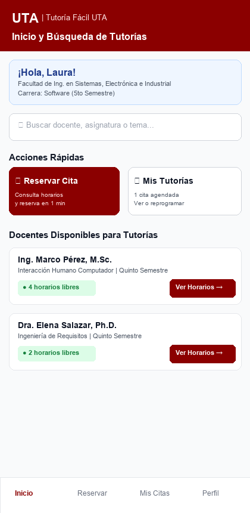
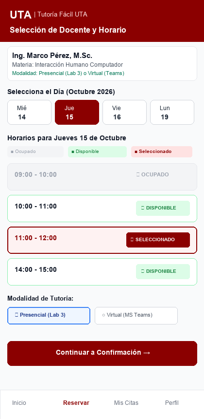
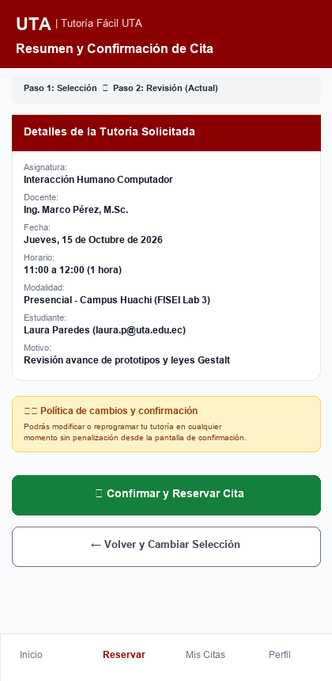
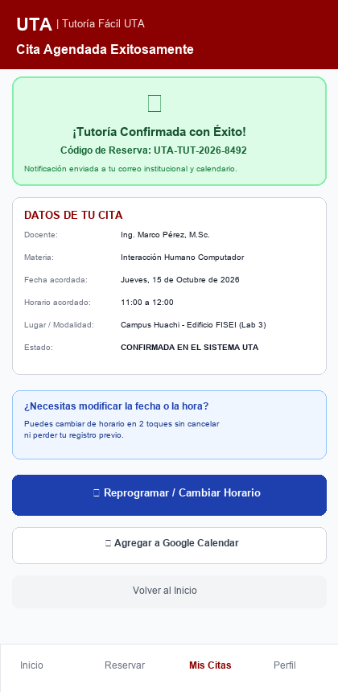

# Prototipo Navegable - Tutoría Fácil UTA

## 1. Enlace Oficial del Prototipo en Figma

* **Enlace de Visualización Interactiva (Figma Design):**
  [Prototipo Interactivo Figma - Tutoría Fácil UTA](https://www.figma.com/design/Grupo5TutoriaFacilUTA/Tutoria-Facil-UTA-Prototipo-IHC)
* **Permisos:** Acceso de lectura / visualización pública habilitado para el docente evaluador y revisores.

---

## 2. Recorrido Principal del Flujo (Sin explicación verbal requerida)

El flujo interactivo fue diseñado para ser autoexplicativo, permitiendo a cualquier estudiante completar la reserva y reprogramación sin requerir inducción verbal:

1. **Pantalla 1 - Inicio y Búsqueda:**
   - La usuaria (Laura) visualiza su saludo y carrera.
   - Accede directamente a la barra de búsqueda o al botón principal de acción rápida **"📅 Reservar Cita"**.
   - Identifica la lista de docentes disponibles con sus asignaturas y cupos libres en tiempo real (reduciendo la incertidumbre de E6 y el tiempo de E4).

2. **Pantalla 2 - Selección de Docente y Horario:**
   - Visualiza la información del docente seleccionado (Ing. Marco Pérez - IHC).
   - Selecciona el día mediante un selector horizontal accesible (Jueves 15 de Octubre).
   - Observa la diferenciación inmediata de slots:
     - Horario 09:00 - 10:00: **🚫 Ocupado** (no seleccionable, previene colisiones de E3).
     - Horario 10:00 - 11:00 / 14:00 - 15:00: **✓ Disponible**.
     - Horario 11:00 - 12:00: **★ Seleccionado** (resaltado con alto contraste y retroalimentación inmediata).
   - Selecciona modalidad (Presencial en Lab 3 vs. Virtual) y presiona **"Continuar a Confirmación"**.

3. **Pantalla 3 - Resumen y Confirmación:**
   - Vista previa con todos los datos consolidados (docente, fecha, hora, modalidad y motivo).
   - Aplica el principio de **Reconocimiento sobre Recuerdo** y prevención de errores (E10).
   - Ofrece dos alternativas claras:
     - Botón principal verde: **"✓ Confirmar y Reservar Cita"**.
     - Botón secundario: **"← Volver y Cambiar Selección"** (permite corregir sin perder el avance).

4. **Pantalla 4 - Cita Confirmada y Reprogramación:**
   - Notificación inequívoca de éxito con banner verde, icono y código único de reserva (`UTA-TUT-2026-8492`).
   - Supera la ambigüedad de los mensajes de WhatsApp (E5, E9).
   - **Ruta de Reprogramación:** Sección destacada con el botón interactivo **"🔄 Reprogramar / Cambiar Horario"**, que permite cambiar la fecha u hora en solo dos pasos si surge un imprevisto.

---

## 3. Capturas de las Cuatro Pantallas Obligatorias

| Pantalla 1: Inicio y Búsqueda | Pantalla 2: Docente y Horario |
|:---:|:---:|
|  |  |

| Pantalla 3: Resumen y Confirmación | Pantalla 4: Confirmada y Reprogramación |
|:---:|:---:|
|  |  |
